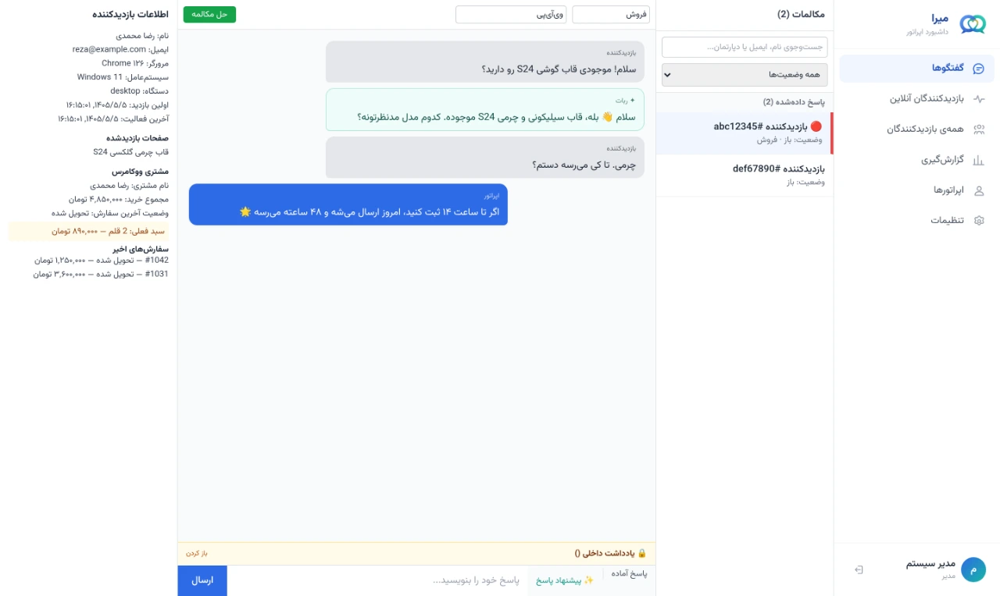
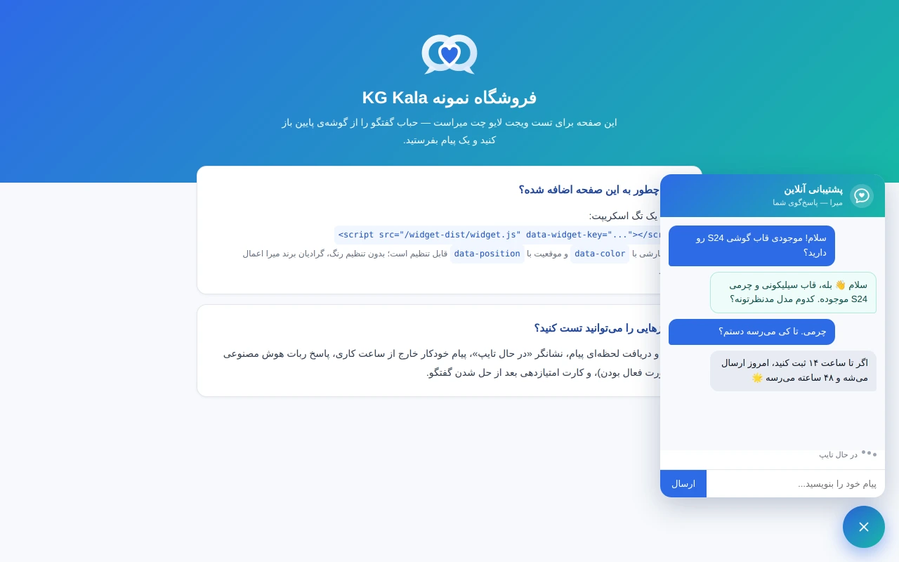
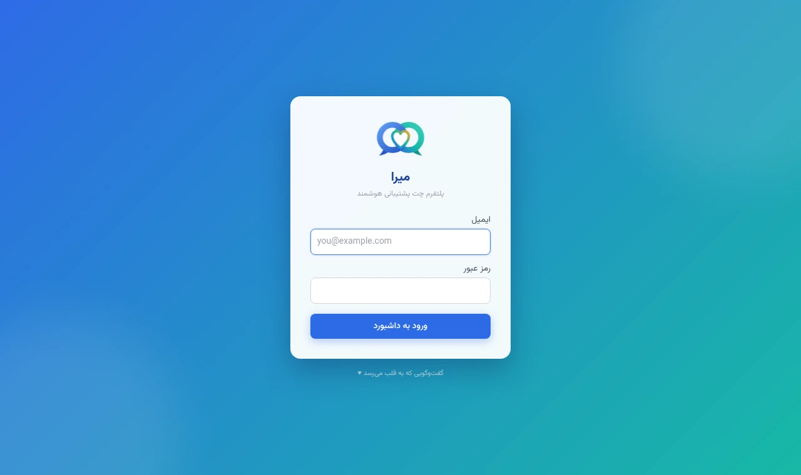
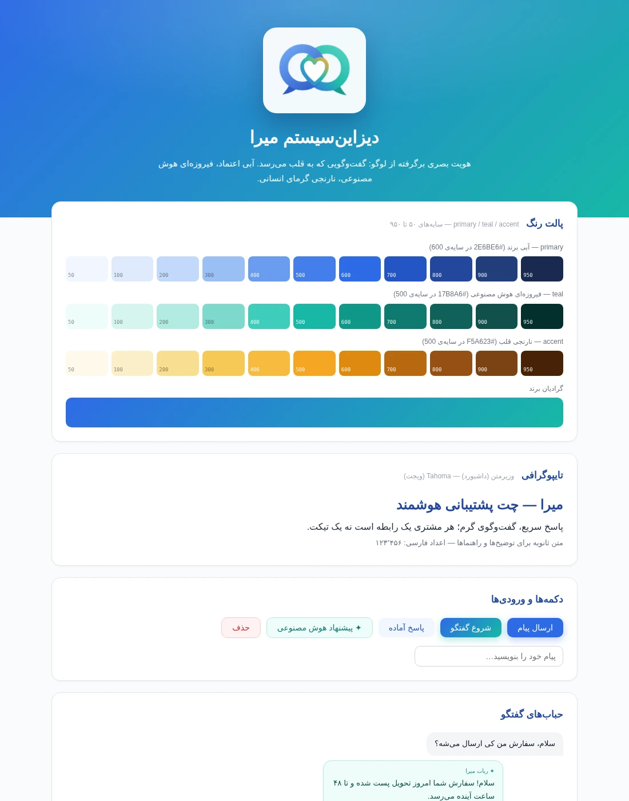

<div align="center">


# میرا

**پلتفرم لایو چت پشتیبانی خودمیزبان با هوش مصنوعی** — جایگزین گفتینو برای وردپرس/ووکامرس

_گفت‌وگویی که به قلب می‌رسد ♥_

[](https://github.com/hami9/mira/actions/workflows/ci.yml)
[](LICENSE)
[](https://github.com/hami9/mira/releases)
[](CONTRIBUTING.fa.md)

[English](README.md) · **فارسی**

| 🚀 [نصب روی سرور (دبیان/اوبونتو/...)](package/INSTALL.fa.md) | 🎨 [راهنمای برند و دیزاین‌سیستم](docs/brand/README.fa.md) | 🤝 [مشارکت](CONTRIBUTING.fa.md) | 🔒 [امنیت](SECURITY.fa.md) |
| ------------------------------------------------------------ | --------------------------------------------------------- | ------------------------------- | -------------------------- |

</div>

---

## نمای محصول

<div align="center">

|                      داشبورد اپراتور                      |                            ویجت چت                            |
| :-------------------------------------------------------: | :-----------------------------------------------------------: |
|  |         |
|                       **صفحه ورود**                       |                       **دیزاین‌سیستم**                        |
|      |  |

</div>

---

> وضعیت فعلی: **همه‌ی فازهای ۰ تا ۷ تکمیل** (نسخه‌ی جاری را بج بالا و [`CHANGELOG.fa.md`](CHANGELOG.fa.md) نشان می‌دهند). چت زنده، داشبورد کامل با هویت برند، افزونه ووکامرس، هوش مصنوعی با RAG، گزارش‌گیری، اتوماسیون و API/وب‌هوک، مدیریت اپراتور با دسترسی نقش‌محور، سخت‌سازی امنیتی با SSL خودکار و بک‌آپ دوره‌ای، و پکیج نصب دبیان. راهنمای استقرار و چک‌لیست امنیتی پایین‌تر در همین فایل است.

> 🤖 **اگر یک عامل هوش مصنوعی هستی که قرار است روی این پروژه کار کند:**
> نقشه‌ی کارهای بعدی: [`ROADMAP.fa.md`](ROADMAP.fa.md).
> پیش از هر تغییری [`AGENTS.fa.md`](AGENTS.fa.md) را کامل بخوان — تاریخچه‌ی کامل ساخت،
> دلیل تصمیم‌های معماری، باگ‌های واقعی رفع‌شده، تله‌های محیط، و کارهای تست‌نشده.

## نصب سریع روی سرور (پیشنهادی)

روی دبیان/اوبونتو با پکیج آماده — سه دستور تا داشبورد با SSL:

```bash
sudo dpkg -i mira_*_all.deb   # از GitHub Releases یا bash package/build-deb.sh
sudo mira setup               # تولید خودکار همه‌ی رمزها + پرسیدن دامنه‌ها
sudo mira start
```

راهنمای کامل (همه‌ی توزیع‌ها، وردپرس، عیب‌یابی): **[`package/INSTALL.fa.md`](package/INSTALL.fa.md)**
— بقیه‌ی این README مستندات توسعه و استقرار دستی است.

> ⚡ ایمیج‌های آماده‌ی Docker هم با هر نسخه در
> [GitHub Packages](https://github.com/hami9?tab=packages&repo_name=mira) منتشر می‌شوند
> (`mira-api`، `mira-worker`، `mira-dashboard`) — در `mira setup` گزینه‌ی «ایمیج آماده» را
> انتخاب کن تا نصب بدون build و در چند دقیقه انجام شود.

## استک فنی

| بخش                   | فناوری                                                    |
| --------------------- | --------------------------------------------------------- |
| بک‌اند + Realtime     | Node.js, NestJS, Socket.io                                |
| صف پس‌زمینه           | BullMQ روی Redis                                          |
| دیتابیس               | PostgreSQL + pgvector                                     |
| کش/presence           | Redis                                                     |
| ذخیره فایل            | S3-compatible (MinIO برای dev)                            |
| داشبورد اپراتور/ادمین | React + Vite + TypeScript + Tailwind CSS                  |
| ویجت جاسازی‌شونده     | TypeScript خالص، بدون فریمورک                             |
| افزونه وردپرس         | PHP خالص                                                  |
| هوش مصنوعی            | لایه انتزاعی `AiProvider` (OpenAI-compatible / Anthropic) |

## ساختار مونوریپو

```
mira/
  apps/
    api/         # NestJS backend + Socket.io gateway ✅
    worker/      # پردازشگرهای BullMQ (اسکلت — منطق واقعی از فاز ۴)
    dashboard/   # داشبورد React اپراتور/ادمین ✅
    widget/      # ویجت جاسازی‌شونده ✅
  packages/
    shared-types/  # تایپ‌های مشترک بین api/dashboard/widget
  wordpress-plugin/
    mira/        # افزونه PHP وردپرس/ووکامرس ✅
    docker-compose.test.yml  # سایت ووکامرس یک‌بارمصرف برای تست افزونه (جدا از استک اصلی)
  infra/
    postgres/init/ # اسکریپت‌های init دیتابیس (فعال‌سازی pgvector)
  docker-compose.yml
  .env.example
```

## پیش‌نیازها

- Docker و Docker Compose (کافیه — همه چیز از جمله Node.js داخل کانتینرها اجراست)

## راه‌اندازی

۱. فایل `.env` را از نمونه بساز و مقادیر `*_PASSWORD`/`*_SECRET` را با مقادیر تصادفی امن جایگزین کن (مثلاً با `openssl rand -hex 32`):

```bash
cp .env.example .env
```

۲. کل استک را بالا بیاور (build اولیه ممکنه چند دقیقه طول بکشه، `npm install` کامل مونوریپو):

```bash
docker compose up -d --build
```

۳. بررسی سلامت سرویس‌ها:

```bash
docker compose ps
```

`postgres`، `redis`، `minio` و `api` باید `healthy` باشن؛ `dashboard` وضعیت health-check ندارد ولی باید `running` باشه.

هنگام بالا آمدن سرویس `api`، به‌صورت خودکار (idempotent، امن برای هر بار ری‌استارت):

- مایگریشن‌های دیتابیس اجرا می‌شن
- یک سایت نمونه (`KG Kala`) و یک اپراتور ادمین seed می‌شن

> ⚠️ **فقط محیط توسعه‌ی محلی.** مقادیر زیر پیش‌فرض seed برای توسعه‌اند و در
> `NODE_ENV=production` اصلاً کار نمی‌کنند: اگر `SEED_ADMIN_PASSWORD` تنظیم نشده باشد
> seed با خطا متوقف می‌شود. روی سرور واقعی، `mira setup` همه‌ی این مقادیر را
> تصادفی و امن تولید می‌کند.

**اطلاعات ورود اپراتور نمونه:** `admin@kgkala.test` / `ChangeMe123!` (نقش admin — دسترسی به «تنظیمات» در داشبورد را هم دارد)
**widgetKey نمونه:** `kgkala-demo-key` (دامنه مجازش `http://localhost:3000` است)

### تست دستی فاز ۱ — یک گفتگوی زنده کامل

۱. یک تب مرورگر باز کن روی `http://localhost:3000/demo.html` — این صفحه ویجت رو با widget key نمونه لود می‌کنه. روی حبابِ آبی گوشه پایین کلیک کن و یک پیام بفرست.
۲. یک تب دیگه باز کن روی `http://localhost:5173` (داشبورد) و با اطلاعات ادمین بالا وارد شو.
۳. مکالمه‌ی تازه باید در لیست ظاهر بشه (اگه فوراً نیومد، چند ثانیه صبر کن یا صفحه رو رفرش کن)؛ روش کلیک کن.
۴. پیام بازدیدکننده باید در پنجره چت دیده بشه؛ از داشبورد پاسخ بده و ببین در تب ویجت لحظه‌ای دریافت می‌شه (و برعکس). نشانگر «در حال تایپ» هم باید کار کنه.

> این سناریو با یک اسکریپت خودکار (اتصال دو Socket.io مستقل + بررسی sanitize شدن HTML مخرب) هم تأیید شده؛ در بخش [یادداشت‌های فنی](#یادداشتهای-فنی-فاز-۱) توضیح داده شده.

### چک‌لیست تست دستی فاز ۲ — داشبورد کامل

هر مورد با یک تست واقعی (curl/socket یا مرورگر) در حین توسعه تأیید شده:

- [x] **پاسخ‌های آماده** — از داشبورد وارد «تنظیمات» شو، یک پاسخ آماده با میانبر/عنوان/متن اضافه کن؛ داخل پنجره چت روی دکمه‌ی «پاسخ آماده» کلیک کن و ببین در کادر پیام درج می‌شه.
- [x] **پنل اطلاعات بازدیدکننده** — کنار پنجره چت، مرورگر/سیستم‌عامل بازدیدکننده (استخراج‌شده از User-Agent) و لیست صفحاتی که در سایت بازدید کرده نشون داده می‌شه.
- [x] **امتیازدهی CSAT** — روی دکمه‌ی «حل مکالمه» در بالای پنجره چت کلیک کن؛ در تب ویجت یک کارت ستاره‌دار امتیازدهی ظاهر می‌شه. اگه بعد از حل شدن، بازدیدکننده دوباره پیام بفرسته، مکالمه خودکار «باز» می‌شه.
- [x] **دپارتمان/برچسب و فیلتر** — در بالای پنجره چت دپارتمان و برچسب‌ها رو ست کن؛ در لیست مکالمات با فیلتر وضعیت و جست‌وجو (نام/ایمیل/دپارتمان بازدیدکننده) قابل پیدا کردنه.
- [x] **جست‌وجوی مکالمات** — تایپ در کادر جست‌وجوی بالای لیست مکالمات (با debounce) نتایج رو زنده فیلتر می‌کنه.
- [x] **ساعت کاری + پیام خودکار خارج از ساعت کاری** — در تنظیمات، روزهای هفته رو تنظیم/غیرفعال کن و یک «پیام خارج از ساعت کاری» بنویس؛ وقتی بازدیدکننده خارج از این بازه مکالمه‌ای شروع می‌کنه، این پیام به‌صورت خودکار (فرستنده: ربات) اولین پیام مکالمه می‌شه.
- [x] **پیام محرک زمان‌دار** — در تنظیمات فعالش کن و یک متن/تاخیر بده؛ روی صفحه دمو، بعد از گذشت همون مدت (اگه گفتگو شروع نشده باشه) یک حباب پیشنهادی نزدیک دکمه‌ی چت ظاهر می‌شه.
- [x] **اعلان صوتی/مرورگری** — با پنجره‌ی داشبورد در پس‌زمینه یا مکالمه‌ی دیگری باز، وقتی بازدیدکننده پیام تازه بفرسته، صدای بوق کوتاه پخش و (با اجازه‌ی مرورگر) نوتیفیکیشن نشون داده می‌شه.

### چک‌لیست تست فاز ۳ — افزونه وردپرس/ووکامرس

این فاز روی یک سایت ووکامرس واقعی (نه فرضی) تست شده — راه‌اندازی محیط تست در ادامه توضیح داده شده.

- [x] **صفحه تنظیمات افزونه** (وردپرس → تنظیمات → میرا): آدرس بک‌اند، کلید ویجت، کلید API، رنگ و موقعیت ویجت.
- [x] **تزریق اسکریپت فقط در فرانت‌اند**: روی صفحه اصلی سایت هست، در `/wp-admin/` نیست (تأیید‌شده با curl).
- [x] **REST endpoint امن**: بدون کلید یا با کلید اشتباه → `401`؛ با کلید درست → `200` و داده صحیح (`hash_equals` برای مقایسه timing-safe).
- [x] **نمایش اطلاعات سفارش واقعی — سمت وردپرس**: با یک مشتری و دو سفارش واقعی در ووکامرس، خروجی endpoint (مجموع خرید، وضعیت آخرین سفارش، تاریخچه سفارش‌ها) با curl درست بود.
- [ ] **نمایش اطلاعات سفارش واقعی — انتها به انتها از میرا**: تا نسخه ۱.۱.۰ این مسیر عملاً کار نمی‌کرد؛ نام هدر ارسالی از API فارسی بود (`X-میرا-Api-Key`) و `fetch` اصلاً درخواست را نمی‌فرستاد. باگ رفع شده (بخش ۶ [`AGENTS.fa.md`](AGENTS.fa.md)) و با سرور ماک تأیید شده، ولی هنوز روی یک ووکامرس واقعی از داشبورد میرا دوباره تست نشده.
- [x] **پیش‌فرم خودکار**: برای کاربر واردشده به وردپرس، `data-visitor-name`/`data-visitor-email` خودکار به ویجت پاس داده می‌شود (بدون نیاز به پرسیدن دوباره).
- [x] **پیام محرک سبد رهاشده**: وقتی بازدیدکننده‌ی واردشده سبد غیرخالی دارد، `data-trigger-text`/`data-trigger-delay` روی اسکریپت ویجت ظاهر می‌شود.

#### راه‌اندازی محیط تست وردپرس/ووکامرس (اختیاری، فقط برای تست افزونه)

یک سایت ووکامرس یک‌بارمصرف با Docker (کاملاً جدا از استک اصلی میرا):

```bash
cd wordpress-plugin
docker compose -f docker-compose.test.yml up -d
# نصب اولیه با WP-CLI:
docker compose -f docker-compose.test.yml run --rm wpcli core install \
  --url=http://localhost:8081 --title="KG Kala Test" \
  --admin_user=admin --admin_password=admin123 --admin_email=admin@example.test --skip-email
docker compose -f docker-compose.test.yml run --rm wpcli plugin install woocommerce --activate
docker compose -f docker-compose.test.yml run --rm wpcli plugin activate mira
docker compose -f docker-compose.test.yml run --rm wpcli rewrite flush --hard
```

بعد از فعال‌سازی، از `http://localhost:8081/wp-admin/options-general.php?page=mira-settings` تنظیمات افزونه رو کامل کن (آدرس بک‌اند `http://localhost:3000`، widgetKey همون سایتی که در میرا ساختی، و یک کلید API دلخواه) و همون کلید API رو در تنظیمات داشبورد میرا («اتصال وردپرس/ووکامرس») با `wordpressSiteUrl=http://host.docker.internal:8081` وارد کن (چون این دو Docker Compose جدا از هم هستن، `host.docker.internal` پل بین‌شونه).

### بازساخت بعد از تغییر کد

چون هر سرویس ایمیج Docker خودش رو داره (نه bind-mount)، بعد از تغییر سورس باید rebuild کنی. Dockerfileها به‌گونه‌ای طراحی شدن که لایه‌ی `npm install` جدا کش بشه، پس اگه فقط سورس (نه package.json) عوض شده باشه، rebuild خیلی سریع‌تر از بار اول انجام می‌شه:

```bash
docker compose build api dashboard
docker compose up -d --force-recreate api dashboard
```

### توقف سرویس‌ها

```bash
docker compose down
```

برای حذف کامل داده‌های حجم‌ها (ریست کامل دیتابیس/Redis/MinIO):

```bash
docker compose down -v
```

## کیفیت کد (Lint/Format)

نیاز به Node.js روی host دارد (فقط برای این دستورات، نه برای اجرای پروژه):

```bash
npm install
npm run lint
npm run format:check
```

## یادداشت‌های فنی فاز ۱

- **معماری چندمستأجری:** هر ردیف `agents/visitors/conversations/messages` به `site_id` وصله و هر کوئری با آن فیلتر می‌شه.
- **امنیت توکن:** توکن اپراتور (access کوتاه‌عمر + refresh) و توکن بازدیدکننده (کوتاه‌عمر، مقید به دامنه‌ی `Origin` واقعی) کاملاً مجزا امضا می‌شن. ویجت فقط یک شناسه‌ی تصادفی غیرحساس (`visitorRef`, نه توکن) در localStorage نگه می‌داره.
- **Sanitize:** محتوای پیام قبل از ذخیره با `sanitize-html` کاملاً از تگ خالی می‌شه (تست شده با `<script>` واقعی).
- **بدون پیام تکراری:** پیام‌های چت فقط در اتاق همون مکالمه پخش می‌شن؛ برای اطلاع‌رسانی سراسری به داشبورد (تازه‌سازی لیست) یک event جدا (`conversation:updated`) استفاده می‌شه تا اپراتوری که هم در اتاق سایت و هم در اتاق مکالمه است پیام رو دوبار نبیند.
- **حجم ویجت:** خروجی build شده (`apps/widget/dist/widget.js`) حدود ۱۶KB بعد از gzip است (هدف زیر ۵۰KB).
- **CJS در مقابل مرورگر:** `packages/shared-types` عمداً به CommonJS کامپایل می‌شه (چون NestJS/api با `require` کار می‌کنه). ویجت با esbuild bundle می‌شه پس این تبدیل خودکار انجام می‌شه، ولی داشبورد در dev با Vite این پکیج رو مستقیم (بدون تبدیل) سرو می‌کرد و صفحه سفید می‌شد؛ با افزودن `optimizeDeps.include: ['@mira/shared-types']` در `apps/dashboard/vite.config.ts` رفع شد.
- **محدودیت شناخته‌شده:** نشست داشبورد در حافظه‌ی مرورگر نگه داشته می‌شه (نه localStorage) — با رفرش صفحه باید دوباره لاگین کنی. رفع کامل (refresh token با کوکی httpOnly) در فازهای بعد قابل افزودنه.

## یادداشت‌های فنی فاز ۲

- **رفع باگ — event تکراری:** در فاز ۱، اپراتوری که هم در اتاق `site` و هم در اتاق `conversation` بود پیام رو دوبار می‌گرفت؛ با جدا کردن event پخش سراسری از پخش داخل اتاق رفع شده بود (توضیح کامل در یادداشت فاز ۱ بالا).
- **رفع باگ — پاک شدن خاموش `enabled`:** فیلد `triggerMessage.enabled` هنگام PATCH به‌طور خاموش حذف می‌شد چون `class-validator` با `whitelist: true` هر پراپرتی بدون دکوریتور اعتبارسنجی رو از آبجکت‌های nested حذف می‌کنه. با افزودن `@IsBoolean()` روی `enabled` (در `TriggerMessageDto` و `BusinessHoursDayDto`) رفع شد. این باگ فقط با تست واقعی PATCH→GET کشف شد، نه از روی خوندن کد.
- **رزولوو/ری‌اوپن بدون وابستگی حلقوی ماژول:** چون `ConversationsModule` نمی‌تونه مستقیماً `ChatGateway` (داخل `ChatModule`) رو صدا بزنه بدون حلقه‌ی import، از `@nestjs/event-emitter` استفاده شده: `ConversationsService.resolve()` یک event داخلی (`conversation.resolved`) منتشر می‌کنه و `ChatGateway` با `@OnEvent` به آن گوش می‌ده و پیام Socket.io رو پخش می‌کنه. اگه بازدیدکننده به مکالمه‌ی resolved دوباره پیام بده، خودکار به `open` برمی‌گرده.
- **ساعت کاری با وقت واقعی تهران:** تصمیم «داخل ساعت کاری هستیم یا نه» با `Intl.DateTimeFormat(..., {timeZone: 'Asia/Tehran'})` گرفته می‌شه، نه UTC سرور. برای این‌که این تبدیل روی Alpine درست کار کنه، `tzdata` صریحاً به `apps/api/Dockerfile` اضافه شده (بدون آن، بعضی ایمیج‌های Node-Alpine برای منطقه‌های زمانی غیر متعارف مثل UTC+3:30 درست کار نمی‌کنن) — با یک تست مستقیم داخل کانتینر تأیید شد.
- **بهبود سرعت build:** هر دو Dockerfile (api و dashboard) بازسازی شدن تا لایه‌ی `npm install` جدا از کپی سورس کش بشه؛ قبلاً هر تغییر کوچک سورس یک `npm install` کامل (۵ تا ۱۵ دقیقه) رو دوباره اجرا می‌کرد.
- **CSAT فقط بعد از resolve:** تلاش برای امتیازدهی به مکالمه‌ی هنوز بازتلاش می‌شه رد بشه (۴۰۹)، امتیازدهی تکراری هم رد می‌شه (۴۰۹ با تکیه به unique index دیتابیس) — هر دو با تست واقعی curl تأیید شدن.

## یادداشت‌های فنی فاز ۳

- **دو `docker-compose` مجزا:** سایت ووکامرس تستی عمداً در `wordpress-plugin/docker-compose.test.yml` جداست (نه در `docker-compose.yml` اصلی) — چون در دنیای واقعی مشتری‌ها سایت وردپرس خودشون رو دارن؛ این فقط یک فیکسچر تست یک‌بارمصرفه. اتصال بین دو استک جدا با `host.docker.internal` (که Docker Desktop برای رسیدن از هر کانتینر به هاست فراهم می‌کنه) انجام می‌شه.
- **رفع باگ — عدم تطابق UID بین ایمیج‌ها:** نصب WooCommerce با WP-CLI با خطای «Could not create directory» شکست می‌خورد. ریشه‌ی واقعی: ایمیج `wordpress:apache` کاربر `www-data` را با UID **۳۳** می‌سازه (دبیان)، ولی ایمیج `wordpress:cli` همون کاربر رو با UID **۸۲** می‌سازه (آلپاین) — یعنی فایل‌های `wp-content` که با یک کانتینر ساخته می‌شن، با UID دیگه‌ای در کانتینر دیگه غیرقابل‌نوشتن بودن. با `chmod -R 777 wp-content` (فقط در محیط تست) رفع شد.
- **رفع باگ — rewrite rules فلاش‌نشده:** بعد از نصب تازه‌ی وردپرس، `/wp-json/mira/v1/customer-context` به‌جای پاسخ REST، صفحه‌ی اصلی سایت رو برمی‌گرداند چون قوانین rewrite برای permalink هنوز flush نشده بودن. با `wp rewrite structure` + `wp rewrite flush --hard` رفع شد — هر نصب تازه‌ی وردپرس باید این کار رو انجام بده.
- **timeout تماس با وردپرس:** اولین درخواست به REST endpoint وردپرس (بدون کش آبجکت، اجرای سرد PHP/WooCommerce) در محیط تست تا ۱۲ ثانیه طول کشید؛ timeout سمت میرا به ۱۵ ثانیه افزایش یافت. چون این فقط برای نمایش اطلاعات کنار گفتگوست (نه مسیر بلادرنگ چت)، این تاخیر روی خود گفتگو اثر نمی‌گذاره؛ در production با کش آبجکت (Redis/Memcached) روی وردپرس این زمان به‌شدت کمتر می‌شه.
- **بدون کوئری مستقیم SQL:** تمام دسترسی به ووکامرس از طریق APIهای رسمی (`wc_get_orders`, `WC()->cart`) انجام می‌شه؛ افزونه هیچ‌جا مستقیم به `$wpdb` دست نمی‌زنه.
- **رنگ/موقعیت ویجت:** یک نقص از فاز ۱ همین‌جا رفع شد — موقعیت ویجت قبلاً با `inset-inline-end` بود که به `direction` خودِ ویجت (نه سایت میزبان) بستگی داشت؛ به `left`/`right` فیزیکی (مستقل از جهت متن سایت) تغییر کرد تا تنظیم «راست/چپ» افزونه واقعاً همون‌جایی باشه که ادمین انتخاب کرده.

## یادداشت‌های فنی — نشان تعداد نخوانده و جداسازی لیست (بین فاز ۳ و ۴)

- **یک مفهوم واحد به‌جای دو مفهوم مجزا:** «مکالمه‌ی بدون‌پاسخ» و «badge عددی پیام‌های جدید» هر دو روی یک مکانیزم پایه ساخته شدن: تعداد پیام‌های غیر-اپراتور (`visitor`/`bot`) بعد از آخرین زمانی که همون اپراتور مکالمه رو دیده (`conversation_reads.lastReadAt`، به‌ازای هر جفت مکالمه/اپراتور). این عدد هم badge رو می‌سازه، هم معیار «بدون‌پاسخ در مقابل پاسخ‌داده‌شده» است — نه دو منطق جدا.
- **جدول جدید `conversation_reads`:** به‌ازای هر (`conversationId`, `agentId`) یک ردیف با `lastReadAt`؛ با `UNIQUE INDEX` روی این دو ستون و `upsert` نوشته می‌شه (نه insert/update دستی) تا race condition بین چند تب/سوکت باز اپراتور مشکلی ایجاد نکنه.
- **محاسبه‌ی unreadCount با subquery، نه کوئری جدا:** در `ConversationsService.listForSite`، تعداد نخوانده با یک subquery همبسته در همون کوئری اصلی محاسبه می‌شه (`getRawAndEntities()` چون ستون محاسبه‌شده باید با entity هیدریت‌شده ترکیب بشه — `getMany()` این امکان رو نمی‌ده).
- **سه نقطه‌ی مارک‌خوانده‌شدن:** (۱) اپراتور وارد اتاق Socket.io مکالمه می‌شه (`conversation:join`)، (۲) اپراتور پیام می‌فرسته، (۳) اندپوینت `POST /v1/conversations/:id/read` — این سومی صراحتاً از داشبورد صدا زده می‌شه (هم موقع انتخاب مکالمه، هم وقتی پیام تازه برای مکالمه‌ی همین‌الان بازِ اپراتور می‌رسه) تا UI بدون معطلی برای رفت‌وبرگشت سوکت، بلافاصله به‌روز بشه.
- **پیام‌های bot هم «نخوانده» حساب می‌شن:** شرط فیلتر `senderType != 'agent'` است (نه فقط `= 'visitor'`) — چون پیام خودکار bot (مثل پیام خارج از ساعت کاری) هم محتوای تازه‌ای‌ست که اپراتور هنوز ندیده.
- **تست واقعی:** با درج مستقیم پیام در دیتابیس و فراخوانی واقعی `GET /v1/conversations`، تأیید شد که unreadCount درست افزایش می‌یابد، با `POST /v1/conversations/:id/read` صفر می‌شود، و پیام بعدی دوباره مکالمه را به گروه «بدون پاسخ» منتقل می‌کند.

## یادداشت‌های فنی فاز ۴ (هوش مصنوعی)

- **worker یک اپ NestJS نیست:** برخلاف فازهای قبل، `apps/worker` عمداً یک اسکریپت Node ساده با چند `bullmq.Worker` است، نه یک اپ کامل NestJS با TypeORM. دلیل: تنها کاری که worker نیاز داره «چند کوئری SQL خام + فراخوانی AI» است؛ ساختن یک اپ NestJS جدا با DataSource/entity/module مستقل فقط برای این، تکرار زیرساخت apps/api بود بدون سود واقعی در این مقیاس. worker مستقیم با `pg.Pool` و SQL خام کار می‌کنه؛ فقط `packages/shared-types` (بدون وابستگی به دیتابیس) بین دو اپ مشترکه.
- **پل Redis pub/sub به‌جای `@socket.io/redis-emitter`:** چون Socket.io فقط داخل فرآیند api زنده است، worker برای پخش نتیجه (پاسخ ربات، پیشنهاد Copilot) نمی‌تونه مستقیم به کلاینت‌ها برسه. به‌جای افزودن یک پکیج جدید مخصوص این کار، از `ioredis` (که از قبل هم در api و هم قابل‌افزودن به worker بود) با یک کانال pub/sub سبک (`mira:socket-events`) استفاده شد: worker پیام رو publish می‌کنه، `ChatGateway` در api subscribe کرده و با `server.to(room).emit(...)` پخش می‌کنه.
- **بعد embedding تغییر کرد (۱۵۳۶ → ۷۶۸):** جدول `knowledge_base_chunks` در فاز ۰ برای embedding مدل‌های OpenAI (بعد ۱۵۳۶) طراحی شده بود. چون پرووایدر واقعی این استقرار Gemini است، یک مایگریشن جدید (`Phase4AiSchema`) ستون رو به ۷۶۸ تغییر داد. جدول قبل از این فاز خالی بود، پس بدون از دست رفتن داده. مدل `text-embedding-004` برای این کلید API در دسترس نبود (خطای ۴۰۴)؛ به‌جاش از `gemini-embedding-001` استفاده شد که به‌طور پیش‌فرض ۳۰۷۲ بعدی برمی‌گردونه — با پارامتر رسمی `dimensions: 768` در فراخوانی OpenAI-compatible (دقیقاً مثل truncation مدل‌های جدید OpenAI) به همون ۷۶۸ برش می‌خوره تا با ستون pgvector جفت بشه.
- **Gemini از طریق کلاینت OpenAI-compatible:** به‌جای نوشتن یک adapter مخصوص Gemini، از قابلیت رسمی «OpenAI compatibility» گوگل استفاده شد — کلاینت `openai` را با `OPENAI_BASE_URL=https://generativelanguage.googleapis.com/v1beta/openai/` صدا می‌زنیم. همین یک کلاینت برای OpenAI واقعی، Gemini، یا هر endpoint سازگار دیگه (مثل یک مدل self-hosted) کار می‌کنه — فقط با تغییر env، بدون تغییر کد.
- **آستانه‌ی اطمینان با یک فراخوانی، نه دو تا:** به‌جای یک فراخوانی جدا برای «امتیاز اطمینان» و یک فراخوانی دیگه برای «پاسخ»، از مدل خواسته می‌شه دقیقاً با فرمت `CONFIDENCE: <عدد>\nANSWER: <متن>` جواب بده؛ با regex پارس می‌شه. اگر عدد اطمینان زیر آستانه‌ی سایت (`sites.aiConfidenceThreshold`) باشه یا پارس شکست بخوره (fail-safe: یعنی «مطمئن نیستم»)، ربات به‌جای پاسخ، یک پیام کوتاه محول‌کردن به انسان می‌فرسته و مکالمه دست‌نخورده برای اپراتور می‌مونه.
- **Handoff بدون صف/وضعیت جدید:** «تحویل به انسان» هیچ مکانیزم داده‌ی تازه‌ای نداره — فقط یعنی ربات هیچ پیامی (یا فقط یک پیام کوتاه) می‌فرسته و `assignedAgentId` را خالی می‌گذاره؛ چون badge نخوانده (فاز قبل) هرچیزی با `senderType != 'agent'` رو نخوانده حساب می‌کنه، این مکالمه خودکار در گروه «بدون پاسخ» لیست اپراتورها ظاهر می‌شه — کل تاریخچه هم چون همون یک مکالمه‌ست، از اول موجوده (نیازی به کپی/انتقال نیست).
- **escalation فوریت با کلیدواژه، نه AI:** تشخیص فوریت/نارضایتی روی مسیر زنده‌ی پیام (`ChatGateway.onMessageSend`) اجرا می‌شه، پس باید فوری و رایگان باشه — به همین دلیل عمداً یک چک کلیدواژه‌ی ساده است (`containsUrgentKeywords`)، نه یک فراخوانی مدل زبانی کند/پرهزینه روی هر پیام.
- **خلاصه‌سازی غیر‌بلادرنگ:** خلاصه فقط برای مکالمه‌های «طولانی» (۶+ پیام) و فقط بعد از resolve شدن تولید می‌شه، و از طریق Socket.io پخش نمی‌شه — چون مکالمه از قبل بسته شده، اپراتور «همین الان» منتظرش نیست؛ دفعه‌ی بعد که مکالمه رو باز کنه از دیتابیس آماده است.
- **پایگاه دانش فقط با متن مستقیم (V1):** آپلود فایل (PDF/Word) یا URL عمداً در این فاز اضافه نشد — ستون‌های `sourceType`/`sourceUrl` برای آینده در دیتابیس هست، ولی افزودن parser فایل/scraper وب فقط برای V1 اضافه‌کاری بود؛ همون acceptance criterion («آپلود چند سند نمونه») با پیست متن مستقیم هم کامل برآورده می‌شه.
- **رفع باگ — Gemini درخواستی که با نوبت مدل تموم بشه رو رد می‌کنه:** پیاده‌سازی اولیه‌ی Copilot و خلاصه‌سازی، تاریخچه‌ی گفتگو رو به‌صورت چند نوبت متناوب `user`/`assistant` می‌فرستاد؛ وقتی آخرین پیام گفتگو از طرف اپراتور یا ربات بود (یعنی آرایه با نقش «مدل» تموم می‌شد)، Gemini با خطای `400 Requests ending with a model turn are not supported` رد می‌کرد (فقط با تست واقعی روی یک مکالمه‌ای که آخرین پیامش پاسخ ربات بود کشف شد، نه از روی خوندن کد). رفع شد با فرستادن کل تاریخچه به‌صورت یک متن ساده داخل یک `user` turn تنها (نه چند نوبت متناوب) — این هم مشکل رو حل می‌کنه و هم portable‌تره چون به فرض‌های ترتیب نوبت هیچ providerای وابسته نیست.
- **تست واقعی:** آپلود سند نمونه از داشبورد، پرسیدن سوال از ویجت که با ارجاع به همون سند پاسخ داده شه، تست handoff (هم با کلمه‌ی «اپراتور» و هم با سکوت ربات وقتی پایگاه دانش خالیه)، تست escalation فوریت با یک پیام واقعی روی Socket.io، و تست Copilot با یک مکالمه‌ی واقعی — همه با کانتینر واقعی و کلید API واقعی Gemini، نه فقط بازبینی کد.

## یادداشت‌های فنی فاز ۵ (گزارش‌گیری)

- **SQL خام به‌جای TypeORM repository/QueryBuilder:** `ReportsService` مستقیم از `DataSource.query()` استفاده می‌کنه، نه entity repository. دلیل: تجمیع‌های موردنیاز (CTE، `FILTER (WHERE ...)`، join چندجدولی با گروه‌بندی امن در برابر fan-out) با query builder به‌سختی و ناخوانا بیان می‌شن؛ این پروژه از قبل هم برای کوئری‌های تحلیلی‌مانند (مثل subquery شمارش unread در `ConversationsService`) از همین الگو استفاده کرده.
- **تعریف «زمان اولین پاسخ» = فقط پاسخ انسانی:** میانگین زمان اولین پاسخ با یک CTE محاسبه می‌شه که `first_visitor_at` (اولین پیام بازدیدکننده) رو با `first_agent_at` (اولین پیام با `senderType='agent'`، _نه_ `bot`) مقایسه می‌کنه و فقط مکالمه‌هایی که `first_agent_at > first_visitor_at` دارن رو حساب می‌کنه. پاسخ‌های خودکار ربات عمداً از این معیار حذف شدن چون هدف گزارش، سنجش سرعت واکنش اپراتورهاست نه ربات. این رفتار با تست واقعی (یک پیام bot بین پیام بازدیدکننده و پاسخ واقعی اپراتور) تأیید شد — bot نادیده گرفته شد و فقط زمان تا پاسخ اپراتور محاسبه شد.
- **نمودار بدون کتابخانه:** نمودار میله‌ای مکالمه‌ی روزانه با `div`های ساده و درصد ارتفاع CSS ساخته شده، بدون افزودن هیچ کتابخانه‌ی چارت (مثل recharts) — مطابق اصل «بدون پیچیدگی غیرضروری» این پروژه.
- **خروجی فقط CSV، نه Excel واقعی:** چون فایل CSV با BOM (``) در ابتدای فایل در Excel به‌درستی و با فارسی خوانا باز می‌شه، نیازی به افزودن یک کتابخانه‌ی جدید (مثل `exceljs`) برای فرمت `.xlsx` واقعی نبود.
- **تست واقعی:** با درج مستقیم چند مکالمه‌ی resolved (با پیام bot و agent، فاصله‌ی زمانی متفاوت) و چند امتیاز CSAT در دیتابیس، هر سه اندپوینت (`overview`, `agents`, `export`) با توکن ادمین واقعی فراخوانی شدن و اعداد به‌صورت دستی بازمحاسبه و تأیید شدن (میانگین زمان پاسخ، میانگین CSAT، درصد رضایت مثبت، تعداد مکالمه‌ی هر اپراتور) — سپس داده‌های تست پاک شدن.

## یادداشت‌های فنی فاز ۶ (امکانات اضافه)

- **دسترسی‌ها عمداً داخل توکن JWT نیستند:** `PermissionGuard` نقش و دسترسی‌های اپراتور را در هر درخواست تازه از دیتابیس می‌خواند. اگر دسترسی‌ها در توکن ذخیره می‌شدند، وقتی ادمین دسترسی کسی را می‌گرفت، آن اپراتور تا انقضای توکنش (۱۵ دقیقه) همچنان دسترسی داشت. با تست واقعی تأیید شد: بلافاصله بعد از لغو دسترسی، همان توکن قبلی خطای ۴۰۳ می‌گیرد.
- **یادداشت داخلی در جدول جدا، نه به‌عنوان یک `senderType` تازه در `messages`:** اگر یادداشت‌ها در همان جدول پیام‌ها می‌نشستند، هر مسیر کدی که فراموش می‌کرد فیلترشان کند (اندپوینت ویجت، پخش Socket.io، خروجی API عمومی) آن‌ها را به بازدیدکننده نشت می‌داد. جدول جدا یعنی ایزوله‌ی ساختاری، نه ایزوله‌ی وابسته به یادآوری شرط فیلتر.
- **محافظت از آخرین ادمین:** حذف یا تنزل نقش آخرین ادمینِ یک سایت مسدود است، وگرنه سایت برای همیشه بدون دسترسی مدیریتی قفل می‌شد. تغییر نقش خودِ ادمین هم مسدود است.
- **worker لیست وب‌هوک‌ها را در زمان پردازش می‌خواند، نه زمان enqueue:** job فقط `siteId` و رویداد را حمل می‌کند. اگر ادمین بین enqueue و پردازش، آدرس وب‌هوک را عوض یا غیرفعال کرد، همیشه آخرین تنظیمات اعمال می‌شود.
- **امضای HMAC خروجی:** هر درخواست وب‌هوک با هدر `X-Mira-Signature: sha256=HMAC(secret, body)` امضا می‌شود تا سرویس گیرنده مطمئن شود درخواست واقعاً از میرا آمده. با یک سرور گیرنده‌ی واقعی تست و صحت امضا تأیید شد.
- **رفع باگ — جداکننده‌ی کلیدواژه‌های اتوماسیون:** پیاده‌سازی اولیه فقط کامای انگلیسی (`,`) را می‌شناخت، در حالی که placeholder خود داشبورد به کاربر می‌گوید با کامای فارسی (`،`) بنویسد — یعنی هر قانونی که کاربر به‌طور طبیعی می‌ساخت، کل رشته را یک کلیدواژه‌ی واحد می‌گرفت و هیچ‌وقت match نمی‌شد. حالا هر دو پذیرفته می‌شوند و با یک پیام واقعی روی Socket.io تأیید شد که دپارتمان خودکار تنظیم می‌شود.
- **کلید API فقط hash می‌شود:** مثل رمز عبور اپراتور، فقط `sha256` کلید نگه داشته می‌شود و کلید واقعی فقط یک‌بار (لحظه‌ی ساخت) برگردانده می‌شود. `apiKeyPrefix` صرفاً برای این است که ادمین در UI بفهمد کدام کلید فعال است.
- **API عمومی فقط-خواندنی:** نقشه‌راه «API عمومی» خواسته بود؛ عمداً به خواندن مکالمات و پیام‌ها محدود شد (بدون ارسال پیام) تا سطح حمله بی‌دلیل باز نشود.
- **2FA با سکرت ذخیره‌شده ولی غیرفعال تا اولین تأیید:** بین «شروع راه‌اندازی» و «تأیید اولین کد»، `twoFactorEnabled` همچنان `false` می‌ماند — پس یک راه‌اندازی نیمه‌کاره (مثلاً بستن مرورگر وسط کار) هیچ‌وقت اپراتور را از حسابش قفل نمی‌کند. غیرفعال‌کردن هم به کد فعلی نیاز دارد.

## یادداشت‌های فنی مدیریت اپراتور، بازدیدکنندگان و تنظیمات هوش مصنوعی

- **رفع باگ ریشه‌ای «نمی‌توانم وارد شوم»:** اتصال بی‌کارِ Postgres توسط شبکه‌ی داکر بی‌صدا قطع می‌شد و `pg` یک اتصال مرده در pool نگه می‌داشت. علامت گمراه‌کننده‌اش این بود که `/health` (که به دیتابیس کار ندارد) سالم جواب می‌داد ولی هر مسیر وابسته به دیتابیس — از جمله لاگین — تا ابد هنگ می‌کرد. با `keepAlive`، `idleTimeoutMillis` و `connectionTimeoutMillis` در تنظیمات pool رفع شد تا اتصال مرده به‌جای هنگ‌کردن، بازسازی شود.
- **«آنلاین» یعنی فعالیت در ۵ دقیقه‌ی گذشته:** به‌جای نگه‌داشتن یک جدول presence جداگانه (که با قطعی سوکت و چند تب باز پیچیده و ناسازگار می‌شود)، از همان `lastSeenAt` موجود استفاده شد که ویجت با هر page-view و هر پیام تازه‌اش می‌کند.
- **آخرین صفحه‌ی بازدیدکننده با `LEFT JOIN LATERAL`:** با join معمولی روی `visitor_page_views`، هر بازدیدکننده به تعداد صفحاتش تکرار می‌شد و `conversationCount` هم اشتباه می‌آمد (fan-out). با LATERAL و `LIMIT 1` به‌ازای هر بازدیدکننده دقیقاً یک ردیف برمی‌گردد.
- **رفع باگ — نام ستون `visitedAt`:** کوئری‌های صفحات بازدیدکنندگان با نام `viewedAt` نوشته شده بودند در حالی که ستون واقعی `visitedAt` است؛ اندپوینت فهرست با خطای ۵۰۰ می‌افتاد. فقط با اجرای واقعی endpoint کشف شد (نه از روی خواندن کد) و در هر سه لایه (کوئری، تایپ مشترک، کامپوننت) اصلاح شد.
- **تنظیمات هوش مصنوعی واقعاً به worker وصل است:** `temperature`، `maxTokens`، پیام handoff و سقف تعداد پاسخ در هر مکالمه صرفاً در UI ذخیره نمی‌شوند — `bot-reply` آن‌ها را از دیتابیس می‌خواند و اعمال می‌کند. سقف پاسخ، هم جلوی حلقه‌ی بی‌پایان ربات را می‌گیرد و هم هزینه را کنترل می‌کند.
- **به‌روزرسانی جزئی تنظیمات، فیلدهای نفرستاده را پاک نمی‌کند:** با تست واقعی تأیید شد که یک `PATCH` که فقط چند فیلد AI را می‌فرستد، `aiSystemPrompt` را دست‌نخورده باقی می‌گذارد.

## استقرار روی سرور تولید (Production)

### پیش‌نیازهای سرور

- یک سرور لینوکسی با Docker و Docker Compose نسخه‌ی ۲.۲۴ یا بالاتر
- دو رکورد DNS نوع A که به IP سرور اشاره کنند:
  - `chat.example.com` → دامنه‌ی API و ویجت
  - `panel.example.com` → دامنه‌ی داشبورد اپراتور
- پورت‌های ۸۰ و ۴۴۳ باز (برای دریافت خودکار گواهی SSL)

### مراحل

```bash
git clone https://github.com/hami9/mira.git && cd mira
cp .env.example .env
```

سپس در `.env` این‌ها را حتماً پر کن:

```bash
NODE_ENV=production
APP_DOMAIN=chat.example.com
DASHBOARD_DOMAIN=panel.example.com
ACME_EMAIL=you@example.com
PUBLIC_API_URL=https://chat.example.com
CORS_ALLOWED_ORIGINS=https://panel.example.com

# سکرت‌ها — هر کدام را با یک مقدار تصادفی بساز:
#   openssl rand -hex 32
JWT_ACCESS_SECRET=...
JWT_REFRESH_SECRET=...
WIDGET_TOKEN_SECRET=...
POSTGRES_PASSWORD=...
S3_SECRET_KEY=...

# حساب ادمین اولیه (اجباری در production)
SEED_ADMIN_EMAIL=you@example.com
SEED_ADMIN_PASSWORD=...
SEED_WIDGET_KEY=...
SEED_ALLOWED_DOMAINS=https://shop.example.com
```

بعد بالا آوردن با لایه‌ی پروداکشن:

```bash
docker compose -f docker-compose.yml -f docker-compose.prod.yml up -d
```

Caddy خودش گواهی Let's Encrypt را می‌گیرد و تمدید می‌کند. بعد از چند ثانیه:

- داشبورد: `https://panel.example.com`
- API: `https://chat.example.com/health`

### تفاوت لایه‌ی پروداکشن با توسعه

| مورد                  | توسعه                                  | پروداکشن                                |
| --------------------- | -------------------------------------- | --------------------------------------- |
| پورت‌های باز روی هاست | api, dashboard, postgres, redis, minio | فقط ۸۰ و ۴۴۳ (Caddy)                    |
| SSL                   | ندارد                                  | خودکار با Let's Encrypt                 |
| چرخش لاگ              | ندارد                                  | ۱۰ مگابایت × ۵ فایل به‌ازای هر سرویس    |
| بک‌آپ دیتابیس         | ندارد                                  | روزانه، نگه‌داری ۱۴ روز، در `./backups` |
| رمز ادمین             | پیش‌فرض توسعه                          | اجباری از env، وگرنه seed متوقف می‌شود  |

### بک‌آپ و بازگردانی

بک‌آپ‌ها خودکار روزانه در `./backups/mira-<تاریخ>.sql.gz` ساخته می‌شوند.

```bash
# گرفتن یک بک‌آپ فوری
docker exec mira_postgres pg_dump -U "$POSTGRES_USER" "$POSTGRES_DB" | gzip > backup.sql.gz

# بازگردانی
gunzip -c backup.sql.gz | docker exec -i mira_postgres psql -U "$POSTGRES_USER" -d "$POSTGRES_DB"
```

### به‌روزرسانی نسخه

مایگریشن‌ها و seed هر دو idempotent هستند و خودکار پیش از بالا آمدن api اجرا می‌شوند،
پس به‌روزرسانی فقط همین سه خط است:

```bash
git pull
docker compose -f docker-compose.yml -f docker-compose.prod.yml build
docker compose -f docker-compose.yml -f docker-compose.prod.yml up -d
```

قابلیت‌های جدید هر نسخه با یک مایگریشن تازه می‌آیند؛ چون `synchronize` هیچ‌وقت روشن نیست،
اسکیمای دیتابیس فقط با مایگریشن‌های نسخه‌بندی‌شده تغییر می‌کند و داده‌ی موجود از دست نمی‌رود.

## چک‌لیست امنیتی فاز ۷

- [x] **CORS محدود به دامنه‌های ثبت‌شده** — نه `*`. دامنه‌ی داشبورد از env و دامنه‌ی ویجت از `allowedDomains` هر سایت خوانده می‌شود.
- [x] **هدرهای امنیتی + CSP** — `nosniff`, `Referrer-Policy`, `X-Frame-Options`, `Permissions-Policy` روی همه‌ی پاسخ‌ها؛ CSP فقط روی صفحات HTML؛ HSTS فقط در production. هدر `X-Powered-By` حذف می‌شود.
- [x] **Rate limiting روی همه‌ی مسیرهای عمومی ویجت** — ساخت نشست، شروع مکالمه، ارسال پیام (روی Socket.io)، خواندن تاریخچه، ثبت CSAT و page-view.
- [x] **هیچ داده‌ی حساسی در localStorage ویجت نیست** — فقط یک شناسه‌ی تصادفی غیرحساس؛ توکن بازدیدکننده فقط در حافظه می‌ماند.
- [x] **Idempotency ارسال پیام** — هر پیام یک `clientMessageId` دارد و ایندکس یکتای جزئی روی `(conversationId, clientMessageId)` جلوی پیام تکراری هنگام قطعی شبکه را می‌گیرد.
- [x] **ایندکس ستون‌های پرکوئری + صفحه‌بندی** — ایندکس‌های ترکیبی روی `(siteId, createdAt)`, `(conversationId, createdAt)`, `(siteId, lastSeenAt)`, `(visitorId, visitedAt)`؛ تاریخچه‌ی چت با `before`/`limit` صفحه‌بندی می‌شود (سقف ۲۰۰).
- [x] **همه‌ی timestampها UTC** — همه‌ی ستون‌ها `timestamptz` و نمایش در داشبورد با `toLocaleString('fa-IR')`.
- [x] **health-check + سیاست restart** — هر سرویس `healthcheck` و `restart: unless-stopped` دارد؛ api تا سالم‌شدن postgres و redis صبر می‌کند.
- [x] **مدیریت سکرت فقط از env** — هیچ سکرتی در سورس نیست، `.env` در `.gitignore` است، و لاگ هیچ‌وقت رمز/توکن چاپ نمی‌کند (seed هم فقط ایمیل را لاگ می‌کند، نه رمز).
- [x] **راهنمای استقرار production** — بالاتر در همین README: دامنه، SSL خودکار، بک‌آپ دوره‌ای، چرخش لاگ.
- [x] **حذف داده‌ی بازدیدکننده برای حریم خصوصی** — `DELETE /v1/visitors/:id` که با CASCADE همه‌ی مکالمات، پیام‌ها، امتیازها و بازدید صفحات آن فرد را پاک می‌کند؛ پشت دسترسی جداگانه‌ی «حذف داده‌ی بازدیدکننده».
- [ ] **پیوست فایل** — این نسخه قابلیت آپلود پیوست ندارد (ستون `attachmentUrl` برای آینده رزرو شده)، پس محدودیت نوع/حجم و لینک امضادار موضوعیت ندارد. هر زمان پیوست اضافه شود، این بند باید پیش از انتشار تیک بخورد.

## یادداشت‌های فنی فاز ۷ (سخت‌سازی)

- **هدرهای امنیتی دستی به‌جای helmet:** فقط چند هدر ثابت لازم بود؛ افزودن یک وابستگی برای ~۲۰ خط، با اصل «بدون پیچیدگی غیرضروری» پروژه جور نبود. CSP هم عمداً فقط روی پاسخ‌های HTML ست می‌شود — روی JSON بی‌معنی است و روی سایت مشتری، CSP را خودِ آن سایت تعیین می‌کند.
- **Idempotency با ایندکس یکتای جزئی، نه صرفاً چک قبل از درج:** چک «اول بخوان بعد بنویس» در رقابت دو ارسال هم‌زمان می‌شکند. ایندکس یکتا (`WHERE clientMessageId IS NOT NULL`) تضمین دیتابیسی می‌دهد و کد، خطای نقض یکتایی (`23505`) را می‌گیرد و همان ردیف برنده را برمی‌گرداند. جزئی بودن ایندکس لازم است چون پیام‌های ربات و پیام‌های قدیمی `clientMessageId` ندارند.
- **`!override` برای بستن پورت‌ها:** در Compose، لیست `ports` بین فایل‌ها ادغام (append) می‌شود نه جایگزین. بدون `!override`، پورت‌های توسعه در پروداکشن هم باز می‌ماندند — یعنی Postgres روی اینترنت. با `!override []` صریحاً خالی می‌شوند و فقط Caddy پورت دارد.
- **بک‌آپ با حلقه‌ی sh به‌جای cron:** کانتینر همیشه در حال اجراست و `restart: unless-stopped` داکر تضمین می‌کند بعد از ری‌استارت سرور دوباره بالا بیاید — بدون نیاز به نصب و تنظیم cron داخل ایمیج.
- **رفع نشت رمز در لاگ:** `seed.ts` رمز ادمین را در stdout چاپ می‌کرد، یعنی رمز در لاگ کانتینر می‌نشست. حالا رمز هرگز چاپ نمی‌شود و در `NODE_ENV=production` اگر `SEED_ADMIN_PASSWORD` ست نشده باشد seed با خطا متوقف می‌شود — تا هیچ استقراری با رمز عمومیِ معلوم بالا نیاید.

## فازها

| فاز | محتوا                                                                      | وضعیت    |
| --- | -------------------------------------------------------------------------- | -------- |
| ۱   | هسته چت زنده (NestJS + Socket.io + ویجت پایه + داشبورد مینیمال)            | ✅ تکمیل |
| ۲   | داشبورد کامل (پاسخ آماده، CSAT، دپارتمان، ساعت کاری)                       | ✅ تکمیل |
| ۳   | افزونه وردپرس/ووکامرس                                                      | ✅ تکمیل |
| ۴   | هوش مصنوعی (RAG، Copilot، handoff)                                         | ✅ تکمیل |
| ۵   | گزارش‌گیری                                                                 | ✅ تکمیل |
| ۶   | امکانات اضافه (اتوماسیون، یادداشت داخلی، API/وب‌هوک، 2FA، دسترسی نقش‌محور) | ✅ تکمیل |
| ۷   | سخت‌سازی و استقرار نهایی                                                   | ✅ تکمیل |

جزئیات کامل هر فاز و معیار پذیرش آن در پرامپت اصلی پروژه موجود است.

## لایسنس

میرا تحت مجوز **[AGPL-3.0](LICENSE)** منتشر می‌شود: استفاده، تغییر و میزبانی آزاد است؛
اما هر نسخه‌ی تغییریافته — حتی اگر فقط به‌صورت سرویس آنلاین ارائه شود — باید سورسش را با
همین مجوز در اختیار کاربرانش بگذارد.

**استثنا:** افزونه‌ی وردپرس (`wordpress-plugin/mira`) طبق الزام اکوسیستم وردپرس تحت
**GPLv2 یا جدیدتر** است (در هدر خود افزونه و `readme.txt` ذکر شده).
